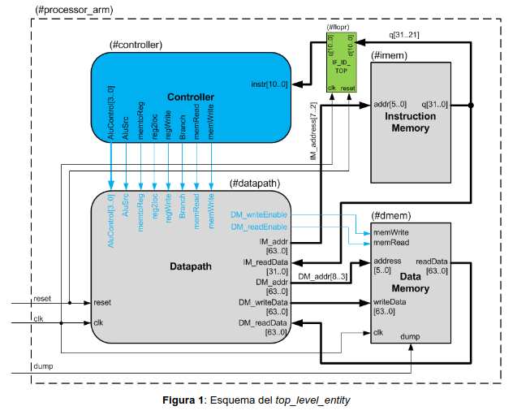
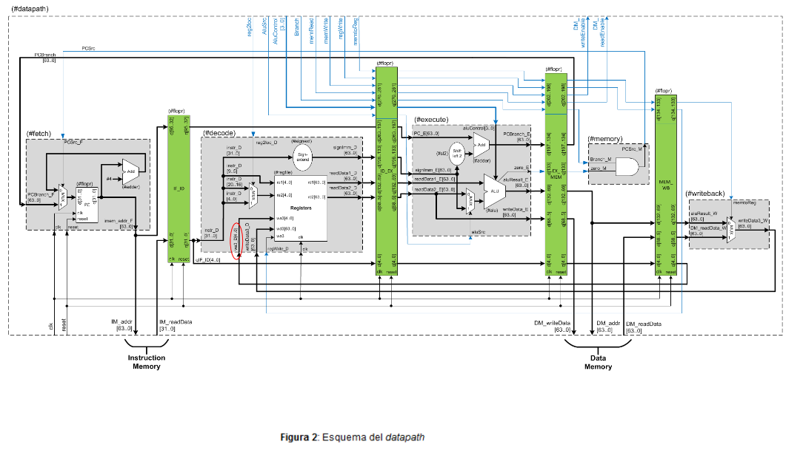

# Laboratorio ARMv8 en SystemVerilog
El laboratorio está basado en la implementación del microprocesador ARMv8 en una versión reducida. Se divide en dos partes Laboratorio 1 y Laboratorio 2.

## Objetivos
**Laboratorio 1:**
* Desarrollar códigos en lenguaje SystemVerilog para describir circuitos secuenciales y combinacionales vistos en el teórico y el práctico.
* Utilizar la herramienta Quartus para analizar y sintetizar el código SystemVerilog.
* Aprender a reutilizar código SystemVerilog mediante módulos estructurales.
* Mediante el uso de test bench, analizar las formas de onda y testear los resultados.
* Aplicar los conceptos aprendidos sobre microprocesadores y la técnica de mejora de
rendimiento: segmentación de cauce (pipeline).

**Laboratorio 2:**
* Utilizar una herramienta de simulación que permita analizar la performance de un
microprocesador con distintas microarquitecturas.
* Analizar cómo impactan en la performance de un microprocesador variaciones en
los tamaños y características de caché y predictores de saltos.
* Comparar el rendimiento de un microprocesador con ejecución en orden respecto a
uno fuera de orden

# Estructura
La estructura del procesador es la siguiente:



# Ejercicios
Ver como se resolvieron los ejercicios de la primera parte y más detalles de los mismos [aquí](Laboratorio1/README.md). 
Los otros ejercicios de la segunda parte [aquí](Laboratorio2/Informe.md)
## Ejercicio 1
Sin afectar el funcionamiento de las instrucciones ya implementadas en la versión reducida
del microprocesador con pipeline, agregar las instrucciones **ADDI y SUBI**. Introducir en el
procesador todas las modificaciones necesarias, tanto en el datapath como en las señales
de control. Testear estas funciones. Es decir, se debe analizar que todo el set de instrucciones continúe
funcionando correctamente y también las instrucciones tipo I agregadas (para esto pueden
escribir los resultados en memoria y verificar si obtienen los valores correctos en
“mem.dump” al finalizar la ejecución del código). No olvidar resolver los eventuales
problemas de hazard agregando instrucciones “nop”.

## Ejercicio 2
Sin afectar el funcionamiento de las instrucciones ya implementadas en el ejercicio 1, agregar las instrucciones de saltos
condicionales **B.cond** y las instrucciones aritméticas que configuran las banderas del
microprocesador: **ADDS, SUBS, ADDIS y SUBIS**. Estas últimas instrucciones son necesarias para que los saltos condicionales (B.cond) puedan determinar si deben saltar o no.
Para que este ejercicio sea considerado correctamente implementado, el microprocesador
debe cumplir los siguientes requerimientos:

* La ALU debe generar las 4 banderas existentes en el microprocesador estudiado: Zero,
Negative, Carry y oVerflow. Además debe generar la señal write_flags que indica si se
deben actualizar las banderas o no.
* En las nuevas instrucciones ADDS, SUBS, ADDIS y SUBIS la señal alucontrol debe ser
similar al de las ADD, SUB, ADDI y SUBI (respectivamente) pero con un ‘1’ en el bit más
significativo.
* Debe existir un registro de flags llamado CPSR_flags, de cuatro bits, que almacene el
estado de las banderas (Z, N, C, V). Este registro debe escribirse únicamente cuando se
ejecuta una instrucción que setee flags (ADDS, SUBS, ADDIS o SUBIS).
* Debe crearse una nueva señal de control llamada condBranch que indica si se debe
realizar un salto condicional.
* Se deben agregar las 14 condiciones de saltos existentes en el set de instrucciones
LEGv8. El salto condicional es una instrucción tipo CB. En los cinco bits menos
significativos se indica qué condición se debe cumplir para que se tome el salto de la forma
correcta.
* Todas las demás instrucciones, incluida la de salto CBZ, deben continuar funcionando
normalmente.

## Ejercicio 3
El procesador LEGv8 desarrollado no tiene la capacidad de detectar la ocurrencia de
hazards de ningún tipo. En este ejercicio se propone la implementación de un bloque de
detección de hazards (Hazard Detection Unit) y otro de forwarding (Forwarding Unit), a fin
de aplicar la técnica de forwarding-stall en caso de la ocurrencia de un data hazard, hasta
que el mismo desaparezca.
Algunas aclaraciones respecto a la implementación:
*  La HDU debe implementarse en la instancia del Instruction decode (ID).
* Las diversas condiciones para la detección de un data hazard se analizan en el
capítulo 4.7- “Data Hazards: Forwarding vs Stalling” del libro “Computer Organization
and Design - ARM Edition” de D.Patterson y J. Hennessy. Se deben considerar
TODAS las condiciones para todos los tipos de dependencias de datos.
* Para generar la condición de stall en el procesador es necesario:
    * Evitar que el PC avance a la siguiente instrucción en el siguiente CLK y evitar
que el registro de pipeline IF/ID cambie de valor en el siguiente CLK
(congelar su valor). Para esto deberán diseñar una nueva entidad FLOPRE
similar al FLOPR, pero agregando una señal de enable (habilitación).
Funcionamiento: enable = 1 el funcionamiento es normal, enable = 0 no
altera el valor de salida al detectar un flanco de CLK (síncrono).
    * Forzar que todas las señales de control a partir del ciclo EX en adelante
tomen el valor “0” (Ver implementación de referencia en Fig 4.59).
* ¡No olvidar que una parte del registro IF/ID está en la entidad #processor_arm

# Laboratorio 2

Para esta parte se pretende que el alumno sea capaz de comparar y analizar el impacto de modificar características de la microarquitectura de un procesador en
la velocidad de ejecución de distintos códigos. Para esto se utiliza el simulador **gem5**, el
cual tiene una precisión de, al menos, el 5% en la determinación de la cantidad de ciclos de
CLK consumidos en la ejecución de un código en procesadores ARM.

La estructura de archivos se basa en dos carpetas principales, la primera llamada "benchmarks", donde se encuentran
tres templates donde resolver los tres ejercicios planteados. La segunda se llama "scripts",
en la cual están los archivos necesarios para configurar y ejecutar la simulación. Dentro de
esta carpeta, los archivos de configuración son:
* cpu_config.toml: es posible elegir características de la memoria principal y algunas
globales del procesador.
* in_order.py y out_of_order.py: template con la configuración del predictor de salto
y la caché.
Los comandos para correr la simulación y para editar las características se detallan en el
archivo [readme](Laboratorio2/README.md)

## Ejercicio 1
Daxpy es la rutina principal del **LINPACK Benchmark**, utilizado para determinar la
performance de microprocesadores, principalmente debido a su alta carga de cálculo de
punto flotante. Sea alpha una constante, X, Y y Z vectores de longitud N (todos ellos
expresados como valores en punto flotante), el cálculo se realiza como se muestra a
continuación:

```cpp
const int N;
double X[N], Y[N], Z[N], alpha;
for (int i = 0; i < N; ++i)
{
    Z[i] = alpha * X[i] + Y[i];
}
```

Considerando que N = 4096, se pide:
1. Escribir el código del microbenchmark daxpy en assembler ARMv8 y verificar su
funcionamiento con qemu.
2. Correr la simulación para los siguientes tamaños de caché de datos: [8KB, 16KB,
32KB] de mapeo directo (1 vía) y obtener las siguientes métricas: número de ciclos
(numCycles), ciclos ociosos (idleCycles), hits totales en la caché de datos
(overallHits) y hits de lectura en la caché de datos (ReadReq.hits).
3. Repetir el punto 2) pero para cachés asociativas por conjuntos de 2, 4 y 8 vías
(parámetro “asoc” en el archivo in_order.py)
4. Graficar las métricas obtenidas en los puntos 2) y 3), realizar un análisis y justificar
estos resultados respecto al código escrito en el punto 1).
5. Reescribir el código utilizando técnicas estáticas de mejora, como loop unrolling,
instrucciones condicionales, etc., para mejorar el rendimiento utilizando una caché
de mapeo directo (1 vía) y el tamaño de 32KB para obtener rendimientos similares a
los de 2 vías.
6. Ejecutar la simulación utilizando el procesador out-of-order con las características de
la caché utilizada en el punto 5) y comparar los resultados.

En el informe se deben incluir los gráficos del punto 4) con el respectivo análisis, una breve
explicación de las técnicas de mejoras aplicadas en el punto 5) y una comparación de resultados.

## Ejercicio 2

Se pretende simular el flujo de calor en una placa de un material uniforme. Si bien este
fenómeno es continuo, es usualmente resuelto mediante métodos de discretización, lo que
genera grandes matrices a procesar. Considerar que se dispone de una placa cuadrada
plana de un material uniforme (ej: una plancha de metal) y en algunos puntos de esta placa
se aplica calor con una fuente de calor (ej: una llama) de modo de mantener una alta
temperatura de manera constante en ese punto. Si bien la aplicación de calor es puntual, el
calor tiende a distribuirse alrededor de la fuente y, luego de cierto tiempo, los lugares de la
placa cercanos a la fuente estarán más calientes que los lejanos. En esta simulación
modelamos como varía la temperatura en distintos puntos del material a lo largo del tiempo.

Como se mencionó anteriormente, la temperatura varía continuamente a lo largo de la
placa, sin embargo, nuestro modelo va a ser discreto. Es decir, se divide la placa en una
cantidad finita de áreas, donde mediremos la temperatura promedio en cada una de esas
áreas. La división de la placa se hará en una grilla uniforme de N×N bloques, donde para
cada área se almacenará la temperatura en un double conformándose una matriz de NxN
elementos. La placa está inicialmente a temperatura ambiente (t_amb) lo que implica que
debe ser inicializada a este valor. La temperatura de la fuente de calor es constante y por lo
tanto, no debe ser modificada en el proceso de simulación. La temperatura de todos los
demás puntos se calcula promediando las temperaturas de los puntos adyacentes a una
posición (x, y) (arriba, abajo, izquierda, derecha), pero teniendo cuidado con los bordes. El
borde no debe ser parte de la matriz de temperaturas. Por ejemplo, para N = 10, el cálculo
de la temperatura para cada tipo de celda se realizaría de la siguiente manera :

- $$ t(0, 0) = \frac{t_{1,0} + t_{0,1} + t_{amb} + t_{amb}}{4} $$
- $$ t(9, 3) = \frac{t_{8,3} + t_{9,2} + t_{9,4} + t_{amb}}{4} $$
- $$ t(6, 8) = \frac{t_{6,7} + t_{7,8} + t_{6,9} + t_{5,8}}{4} $$

Con el fin de unificar las implementaciones del algoritmo de simulación física, en la siguiente
página se muestra su codificación en C.
Considerando N = 64 y n_iter = 10, se pide:
1. A partir del código dado, reescribir el algoritmo de la simulación física en assembler
ARMv8 y verificar su funcionamiento en qemu.
2. Ejecutar en gem5 la simulación considerando una caché de datos de mapeo directo
de 32KB y predictor de saltos local (configurado por defecto).
3. Evaluar la cantidad de ciclos que toma su ejecución utilizando cachés asociativa por
conjuntos de 2, 4 y 8 vías. Determinar en qué caso se obtiene la mejor performance
y explicar por qué.
4. En este punto se pretende analizar la diferencia al usar dos predictores de saltos
distintos: local y predictor por torneos (que está compuesto por un predictor local y
uno global). En primer lugar se debe analizar el código e intentar deducir qué tipo de
predictor (local o global) funcionará mejor en cada tipo de salto y cuánto podría mejorar usar el de torneo. Correr el código con el predator local por defecto y
obtener el miss rate calculado como:
condIncorrect / (condPredicted + condIncorrect)
Luego elegir el predictor por torneos (similar al utilizado en el procesador alpha 21264) y obtener nuevamente el miss rate. En ambos casos utilizar las
características de la caché que obtuvo la mejor performance en el punto 3. Analizar
si los resultados se corresponden con lo esperado y justificar.
5. Ejecutar la simulación utilizando el procesador out-of-order con las características de
la caché que obtuvo la mejor performance en el punto 3 y un predictor de saltos por
torneos. Comparar los resultados obtenidos con el punto 4.


### Codificación del algoritmo de simulación física:

```cpp
const int n_iter, fc_x, fc_y;
float fc_temp, sum, x[N*N], x_tmp[N*N], t_amb;

// Esta parte inicializa la matriz, solo es necesaria para verificar el código
for (int i = 0; i < N*N; ++i)
    x[i] = t_amb;
x[fc_x*N + fc_y] = fc_temp;

// —------------------------------------------------------------------------------
for (int k = 0; k < n_iter; ++k) {
    for (int i = 0; i < N; ++i) {
        for (int j = 0; j < N; ++j) {
            if ((i*N + j) != (fc_x*N + fc_y)) {
                sum = 0;
                if (i + 1 < N)
                    sum = sum + x[(i + 1)*N + j];
                else
                    sum = sum + t_amb;
                if (i - 1 >= 0)
                    sum = sum + x[(i - 1)*N + j];
                else
                    sum = sum + t_amb;
                if (j + 1 < N)
                    sum = sum + x[i*N + j + 1];
                else
                    sum = sum + t_amb;
                if (j - 1 >= 0)
                    sum = sum + x[i*N + j - 1];
                else
                    sum = sum + t_amb;
                x_tmp[i*N + j] = sum / 4;
            }
        }
    }
    for (int i = 0; i < N*N; ++i)
        if (i != (fc_x*N + fc_y))
            x[i] = x_tmp[i];
}
```

## Ejercicio 3

Se tomará como caso de análisis para este ejercicio el método de ordenamiento por
burbuja. Este algoritmo es ampliamente difundido por lo que no se incluirá un código en C
con su implementación

1. Escribir un código en assembler ARMv8 donde se implemente un algoritmo de
ordenamiento por burbuja de un vector de N=1000 elementos (utilizar el vector
aleatoriamente inicializado que se provee en el template). El ordenamiento debe ser
ascendente (los números menores deben quedar al principio y los mayores al final
del arreglo). Verificar su correcto funcionamiento en qemu.
2. Reescribir el código utilizando instrucciones condicionales (cset, csel, etc.) para
evitar la ocurrencia de saltos y verificar su funcionamiento en qemu. Utilizar una
caché de 32kB, de mapeo directo y un predictor de saltos por torneo.
3. Simular ambos códigos en gem5 y comparar su rendimiento. Analizar los resultados
y explicar a qué se debe la variación de rendimiento. Utilizar una caché de 32kB, de
mapeo directo y un predictor de saltos por torneo.
4. Simular ambos códigos nuevamente, en este caso utilizando un procesador
out-of-order. Realizar un análisis de estos resultados.

En el informe se deben incluir los resultados de los puntos 3 y 4 y en archivos adjuntos los
códigos generados en los puntos 1 y 2